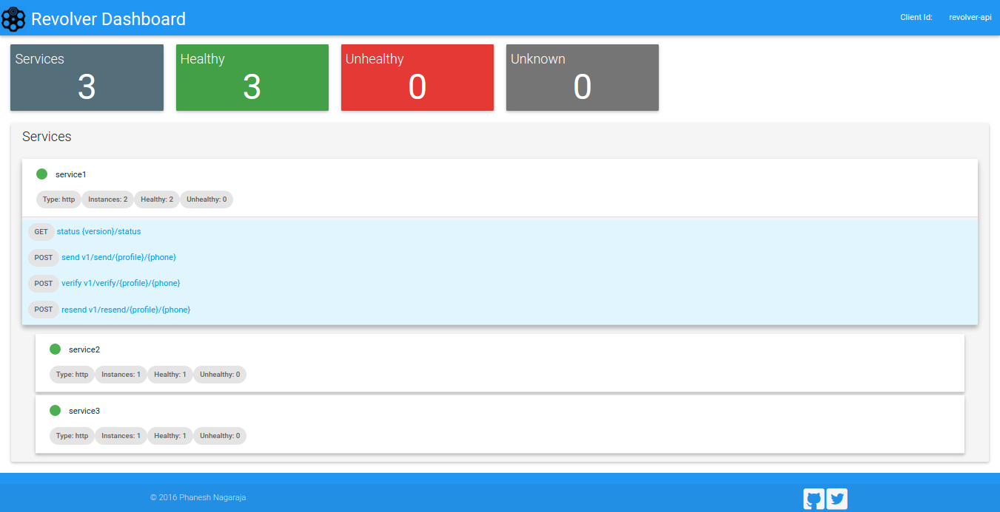

# Revolver Bundle [](https://travis-ci.org/phaneesh/revolver)

This bundle enables one to build downstream proxy with support for transparent callbacks and durable mailbox with polling support.
This bundle compiles only on Java 8.

## Features
* Honours Accept header for common media types (JSON, XML, MsgPack)
* Polling for status of requests
* Durability of requests/responses
* Pluggable persistence provider for requests/responses
 
## Dependencies
* [dropwizard-xml](https://github.com/phaneesh/xml-bundle)
* [dropwizard-msgpack](https://github.com/phaneesh/msgpack-bundle)

## Usage
Build a downstream proxy with ease that enables transparent callback support 
 
### Build instructions
  - Clone the source:

        git clone github.com/phaneesh/revolver

  - Build

        mvn install

### Maven Dependency
Use the following repository:
```xml
<repository>
    <id>clojars</id>
    <name>Clojars repository</name>
    <url>https://clojars.org/repo</url>
</repository>
```
Use the following maven dependency:
```xml
<dependency>
    <groupId>io.dropwizard</groupId>
    <artifactId>dropwizard-revolver</artifactId>
    <version>1.0.0-rc2-SNAPSHOT</version>
</dependency>
```

### Using Revolver bundle

#### Bootstrap

```java
    @Override
    public void initialize(Bootstrap<ApiConfiguration> bootstrap) {
        bootstrap.addBundle(new RevolverBundle<ApiConfiguration>() {

            @Override
            public RevolverConfig getRevolverConfig(ApiConfiguration apiConfiguration) {
                return apiConfiguration.getRevolver();
            }

            @Override
            public PersistenceProvider getPersistenceProvider() {
                return new InMemoryPersistenceProvider();
            }
        });
```

#### Configuration
```yaml
revolver:
  clientConfig:
    clientName: revolver-api
  services:
    - type: http
      service: mocky
      connectionPoolSize: 5
      connectionKeepAliveInMillis: 60000
      authEnabled: false
      endpoint:
        type: simple
        host: www.mocky.io
        port: 80
      apis:
        - api: ping
          async: false
          path: "{version}/56da42e80f0000ac31a427ce"
          methods:
            - GET
          authorization:  #Optional metadata for external authorization systems. Omitting the config will not effect behaviour  
            type: dynamic #can 
            methods:
                - GET
            roles:
                - user
          runtime:
            threadPool:
              concurrency: 5
              timeout: 10000
```

#### Dashboard


Contributors
------------
* [@phaneeshn](https://twitter.com/phaneeshn)
* [Shailesh Satarkar](https://in.linkedin.com/in/theinfiniteloop) - UI/UX Ninja

LICENSE
-------

Copyright 2016 Phaneesh Nagaraja <phaneesh.n@gmail.com>.

Licensed under the Apache License, Version 2.0 (the "License");
you may not use this file except in compliance with the License.
You may obtain a copy of the License at

http://www.apache.org/licenses/LICENSE-2.0

Unless required by applicable law or agreed to in writing, software
distributed under the License is distributed on an "AS IS" BASIS,
WITHOUT WARRANTIES OR CONDITIONS OF ANY KIND, either express or implied.
See the License for the specific language governing permissions and
limitations under the License.